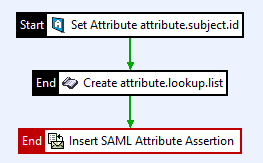

# Create SAML Assertion using the API-Gateway

In cases where the API-Gateway is required to dynamically create a SAML Assertion
to be send to downstream applications. For instance, when a user has been authenticated
and a SAML Assertion on the behalf of the user must be created.

For this purpose, the standard filter: "Insert SAML Attribute Assertion" can be used,
but this filter requires some kind of special input parameters.  

The scripting filter creates the required attribute: `attribute.lookup.list` and can be
combined into a policy like so:  


## Attribute: attribute.subject.id
The authenticated user the SAML-Assertion should belong too.   

Sample: sampleuser  

## Attribute: attribute.lookup.list
A list of attributes that should be part become part of the assertion. In fact, that list must be a  
`java.lang.Map<String, RetrievedAttribute>`.   
This basically looks like:   
```{Key123=key=[Key123] name=[Key123] values=[Value123] namespace=[##nonamespace##] namespaceForAssertion=[urn:vordel:attribute:1.0] useForAssertion=[true], Key0815=key=[Key0815] name=[Key0815] values=[Value0815] namespace=[##nonamespace##] namespaceForAssertion=[urn:vordel:attribute:1.0] useForAssertion=[true]}```

This create a SAML Assertion like so:  
```xml
<saml:Assertion
    xmlns:saml="urn:oasis:names:tc:SAML:2.0:assertion" ID="Id-d4a3315e7303d90009bde218-2" IssueInstant="2020-01-29T15:25:08Z" Version="2.0">
    <saml:Issuer Format="urn:oasis:names:tc:SAML:1.1:nameid-format:X509SubjectName">CN=*.demo.axway.com,OU=Axway IT,O=Axway Inc.,L=Phoenix,ST=Arizona,C=US</saml:Issuer>
    <saml:Subject>
        <saml:NameID Format="urn:oasis:names:tc:SAML:1.1:nameid-format:X509SubjectName">Chris</saml:NameID>
        <saml:SubjectConfirmation Method="urn:oasis:names:tc:SAML:2.0:cm:holder-of-key">
            <saml:SubjectConfirmationData>
                <dsig:KeyInfo
                    xmlns:dsig="http://www.w3.org/2000/09/xmldsig#" Id="Id-d4a3315e7303d90009bde218-1">
                    <enc:EncryptedKey
                        xmlns:enc="http://www.w3.org/2001/04/xmlenc#" Id="Id-0001580311508513-0000000068b4b7ec-1">
                        <enc:EncryptionMethod Algorithm="http://www.w3.org/2001/04/xmlenc#rsa-1_5"/>
                        <dsig:KeyInfo Id="Id-0001580311508568-00000000758700a2-2">
                            <dsig:X509Data>
                                <dsig:X509Certificate>MIIHTzCCBTegAwIBAgIJAKPaQn6ksa7aMA0GCSqGSIb3DQEBBQUAMIGuMQswCQYDVQQGEwJFVTFDMEEGA1UEBxM6TWFkcmlkIChzZWUgY3VycmVudCBhZGRyZXNzIGF0IHd3dy5jYW1lcmZpcm1hLmNvbS9hZGRyZXNzKTESMBAGA1UEBRMJQTgyNzQzMjg3MRswGQYDVQQKExJBQyBDYW1lcmZpcm1hIFMuQS4xKTAnBgNVBAMTIENoYW1iZXJzIG9mIENvbW1lcmNlIFJvb3QgLSAyMDA4MB4XDTA4MDgwMTEyMjk1MFoXDTM4MDczMTEyMjk1MFowga4xCzAJBgNVBAYTAkVVMUMwQQYDVQQHEzpNYWRyaWQgKHNlZSBjdXJyZW50IGFkZHJlc3MgYXQgd3d3LmNhbWVyZmlybWEuY29tL2FkZHJlc3MpMRIwEAYDVQQFEwlBODI3NDMyODcxGzAZBgNVBAoTEkFDIENhbWVyZmlybWEgUy5BLjEpMCcGA1UEAxMgQ2hhbWJlcnMgb2YgQ29tbWVyY2UgUm9vdCAtIDIwMDgwggIiMA0GCSqGSIb3DQEBAQUAA4ICDwAwggIKAoICAQCvAMtwNyuAWko6bHiUfaN/Gh/2NdW928sNRHI+JrKQUrpjOyhYb6WzbZSm891kDFX29ufyIiKAXuFixrYp4YFs8r/lfTJqVKAyGVn+H4vXPWCGhSRv4xGzdz4gljUha7MI2XAuZPeEklPWDrCQiorjh40G072QDuKZoRuGDtqaCrsLYVAGUvGef3bsyw/QHg3PmTA9HMRFEFis1tPo1+XqxQEHd9ZR5gN/ikilTWh1uem8nk4ZcfUyS5xtYBkL+8ydddy/Js2Pk3g5eXNeJQ7KXOt3EgfLZEFHcpOrUMPrCXZkNNI5t3YRCQ12RcSprj1qr7V9ZS+UWBDsXHyvfuK2GNnQm05aSd+pZgvMPMZ4fKecHePOjlO+Bd5gD2vlGts/4+EhySnB8esHnFIbAURRPHsl18TlUlRdJQfKFiC4reRB7noI/plvg6aRArBsNlVq5331lubKgdaX8ZSD6e2wsWsSaR6s+12pxZjptFtYer49okQ6Y1nUCyXeG0+95QGezdIp1Z8XGQpvvwyQ0wlf2eOKNcx5Wk0ZN5K3xMGtr/R5JJqyAQuxr1yW84Ay+1w9mPGgP0revq+ULtlVmhduYJ1jbLhjya6BXBg14JC7vjxPNyK5fuvPnnchpj04gftI2jE9K+OJ9dC1vX7gUMQSibMjmhAxhduub+84Mxh2EQIDAQABo4IBbDCCAWgwEgYDVR0TAQH/BAgwBgEB/wIBDDAdBgNVHQ4EFgQU+SSsD7K1+HnA+mCIG8TZTQKeFxkwgeMGA1UdIwSB2zCB2IAU+SSsD7K1+HnA+mCIG8TZTQKeFxmhgbSkgbEwga4xCzAJBgNVBAYTAkVVMUMwQQYDVQQHEzpNYWRyaWQgKHNlZSBjdXJyZW50IGFkZHJlc3MgYXQgd3d3LmNhbWVyZmlybWEuY29tL2FkZHJlc3MpMRIwEAYDVQQFEwlBODI3NDMyODcxGzAZBgNVBAoTEkFDIENhbWVyZmlybWEgUy5BLjEpMCcGA1UEAxMgQ2hhbWJlcnMgb2YgQ29tbWVyY2UgUm9vdCAtIDIwMDiCCQCj2kJ+pLGu2jAOBgNVHQ8BAf8EBAMCAQYwPQYDVR0gBDYwNDAyBgRVHSAAMCowKAYIKwYBBQUHAgEWHGh0dHA6Ly9wb2xpY3kuY2FtZXJmaXJtYS5jb20wDQYJKoZIhvcNAQEFBQADggIBAJASryI1wqM58C7e6bXpeHxIvj99RZJe6dqxGfwWPJ+0W2aeaufDuV2I6A+tzyMP3iU6XsxPpcG1Lawk0lgH3qLPaYRgM+gQDROpI9CF5Y57pp49chNyM/WqfcZjHwj0/gF/JM8rLFQJ3uIrbZLGOU8W6jx+ekbURWpGqOt1glanq6B8aBMz9p0w8G8nOSQjKpD9kCk18pPfNKXG9/jvjA9iSnyu0/VU+I22mlaHFoI6M6taIgj3grrqLuBHmrS1RaMFO9ncLkVAO+rcf+g769HsJtg1pDDFOqxXnrN2pSB7+R5KBWIBpih1YJeSDW4+TTdDDZIVnBgizVGZoCkaPF+KMjNbMMeJL0eYD6MDxvbxrN8y8NmBGuScvfaAFPDRLLmF9dijscilIeUcE5fuDr3fKanvNFNb0+RqE4QGtjICxFKuItLcsiFCGtpA8CnJ7AoMXOLQusxI0zcKzBIKinmwPQN/aUv0NCB9szTqjktk9T79syNnFQ0EuPAtwQlRPLJsFfClI9eDdOTlLsn+mCdCxqvGnrDQWzilm1DefhiYtUU79nm06PcaewaD+9CL2rvHvRirCG88gGtAPxkZumWK5r7VXNM21+9AUiRgOGcEMeyP84LG3rlV8zsxkVrctQgVrXYlCg17LofiDKYGvCYQbTed7N14jHyAxfDZd0jQ</dsig:X509Certificate>
                            </dsig:X509Data>
                        </dsig:KeyInfo>
                        <enc:CipherData>
                            <enc:CipherValue>fUJiZ9sfZDvbtSxHprQBvrGtL/2WfFwEd7bi2yu111N7phdNSYrCYHLWOF0YDskj
eOkccOCrxcKsZszLoBQpZAzUH1Kjq8utS4qWTkgM7dmlWYoRtCyC5ZqzFnhQPITj
cd9/+7IvjSn6UYdUnu48ALfi5v9cTEQMzt4IBwI6ZvxvbQV45Mbb6wgPu0HgWU3H
5omiW2nF/wEh5JFUZN4R+MHXLuASGy94CzkS/Zt/tPjGJmrGbhbC02ZzW2LlLkH3
95ccb4yM01hzbrASJMn7b7uMjC12uuG38FqhMAohI/Hk6oM/nZDjUSViyDfipbd4
TYnCwMB/o+o0zHNFk4dXcW57YrS0jfQGBYZJ7jojrygW/l7QgUib+Hj3zZeY+W+h
wbFFlfDdMSSuB7d78hMPvwrGEoaYh1mFFWV6oeCT+UqcI0mYjA9tiQK36pYYKxjg
M/7ZI98zfLd2Cq+EqCYHpnnT9zY4i4M7TLSyMpW1IDCeUiUkrVyuN5XFYZyqWps0
U3VyeezCEN6m69A3QyeFX5e3/IQU61kABtAku5lvmWyfBjRTxLYdSY13oaSj9Gu1
W4wbdjfg80USkoxQd/f2AgtTj5kAc5rHR2YI+tGTyiKWSbkyyJxFHCRKCIi/sU6Q
m9jR76mpw+JZScho9L3VP7hR7u0znMFzDHZ9ijxOHVk=</enc:CipherValue>
                        </enc:CipherData>
                    </enc:EncryptedKey>
                </dsig:KeyInfo>
            </saml:SubjectConfirmationData>
        </saml:SubjectConfirmation>
    </saml:Subject>
    <saml:Conditions NotBefore="2020-01-29T15:25:07Z" NotOnOrAfter="2020-02-03T15:25:07Z"/>
    <saml:AttributeStatement>
        <saml:Attribute Name="Key123" NameFormat="urn:vordel:attribute:1.0">
            <saml:AttributeValue>Value123</saml:AttributeValue>
        </saml:Attribute>
        <saml:Attribute Name="Key0815" NameFormat="urn:vordel:attribute:1.0">
            <saml:AttributeValue>Value0815</saml:AttributeValue>
        </saml:Attribute>
    </saml:AttributeStatement>
</saml:Assertion>
```
That assertion can be placed in an attribute of choice.

## Script-Examples
The following script is used to create the required attribute: `attribute.lookup.list`
and can be adjusted as needed.

### Javascript
```javascript
var imp = new JavaImporter(java.util, com.vordel.circuit.attribute);

with(imp) {

 function invoke(msg) {
   var userProperties = new java.util.HashMap();
   var list1 = new ArrayList();
   var list2 = new ArrayList();
   list1.add("Value123");
   list2.add("Value0815");

   var attribute1 = new RetrievedAttribute(6, "Key123", null, list1);
   var attribute2 = new RetrievedAttribute(6, "Key0815", null, list2);
   userProperties.put("Key123", attribute1);
   userProperties.put("Key0815", attribute2);
   msg.put("attribute.lookup.list", userProperties);
   return true;
 }
}
```

### Groovy
N/A

### Jython
N/A

## Changelog
- 0.0.1 - 29.01.2020
  - Initial version


## Limitations/Caveats
- N/A

## Contributing

Please read [Contributing.md](https://github.com/Axway-API-Management-Plus/Common/blob/master/Contributing.md) for details on our code of conduct, and the process for submitting pull requests to us.

## Team

![alt text][Axwaylogo] Axway Team

[Axwaylogo]: https://github.com/Axway-API-Management/Common/blob/master/img/AxwayLogoSmall.png  "Axway logo"
