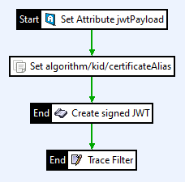
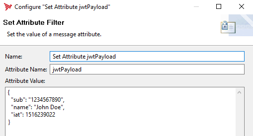
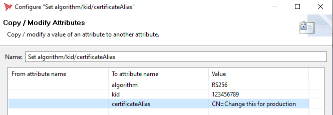

# Create a signed JWT with custom fields

The standard Axway API-Gateway filter: "JWT Sign" doesn't support custom JWT-Header fields. The
default JWT created by the filter looks like this depending on the selected algorithm:
```json
{
"alg":"RS512"
}
```
If you would like to create a JWT with a header like so:
```json
{
"type":"jwt",
"alg":"RS512",
"kid":"3122132"
}
```
you need to use a scripting filter as shown below.

A sample policy may look like this:  


__Set JWT-Payload__  


__Set Required Attributes__  


## Script-Examples

You need to provide the following attributes:  

| Attribute&nbsp;Name | Description | Example |
| ----------- | --------- | ------------- |
| **algorithm** | The Signing-Alghorythm to use. Possible values are: [RS256, RS384, RS512, PS256, PS384, PS512] | RS256 |
|**kid**|The Key-ID parameter|78678678687687|
|**jwtPayload**|An attribute containing the JWT-Payload to sign.|`{"sub": "1234567890","name": "John Doe","iat": 1516239022}`|
|**certificateAlias**|The certificate containing the private key to sign the JWT|CN=Change this for production|

You may extend the script code as you need in case you need to add any other customer header.

### Javascript
```javascript
var imp = new JavaImporter(com.nimbusds.jose,com.nimbusds.jose.crypto, com.vordel.store.cert);
with(imp) {
	function invoke(msg) {
		var algorithm = msg.get("algorithm");
		var kid = msg.get("kid");
		var jwtPayload = msg.get("jwtPayload");
		var certificateAlias = msg.get("certificateAlias");
		var signAlgorithm = JWSAlgorithm.parse(algorithm);

		var privateKey = CertStore.getInstance().getPersonalInfoByAlias(certificateAlias).privateKey;
		var signer = new RSASSASigner(privateKey);
		var builder = new JWSHeader.Builder(signAlgorithm);
		builder.type(JOSEObjectType.JWT);
		builder.keyID(kid);
		var jwsHeader = builder.build();
		var  payload = new Payload(jwtPayload);
		var jwsObject = new JWSObject(jwsHeader, payload);
		jwsObject.sign(signer)
		msg.put("jwt", jwsObject.serialize());
		return true;
	}
}
```

### Groovy
N/A

### Jython
N/A

## Changelog
- 0.0.1 - 30.01.2020
  - Initial version


## Limitations/Caveats
- N/A

## Contributing

Please read [Contributing.md](https://github.com/Axway-API-Management-Plus/Common/blob/master/Contributing.md) for details on our code of conduct, and the process for submitting pull requests to us.

## Team

![alt text][Axwaylogo] Axway Team

[Axwaylogo]: https://github.com/Axway-API-Management/Common/blob/master/img/AxwayLogoSmall.png  "Axway logo"
